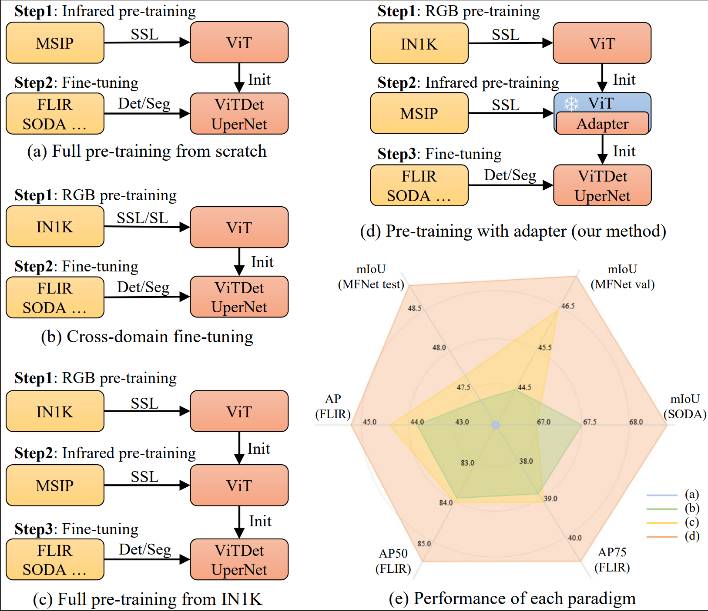
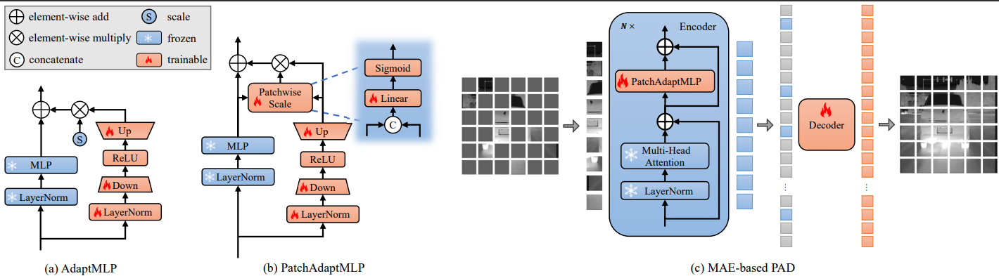

# PAD：Self-Supervised Pre-Training with Patchwise-Scale Adapter for Infrared Images

## Introduction

This repository contains the official PyTorch implementation of the following paper:

> [**PAD：Self-Supervised Pre-Training with Patchwise-Scale Adapter for Infrared Images**](https://arxiv.org/abs/2312.08192),  
> Tao Zhang, Kun Ding, Jinyong Wen, Yu Xiong, Zeyu Zhang, Shiming Xiang, Chunhong Pan  





## Installation

Please refer to [INSTALL.md](docs/INSTALL.md) for installation.

## MSIP Dataset

Please refer to [DATASET.md](DATASET.md) for dataset preparation.

## Pre-training

Please refer to [PRETRAIN.md](docs/PRETRAIN.md) for the pre-training instruction.

## Semantic Segmentation

Please refer to [SEGMENTATION.md](docs/SEGMENTATION.md) for the semantic segmentation instruction.

## Object Detection

Please refer to [DETECTION.md](DETECTION.md) for the object detection instruction.

## Citation

If you find this repository helpful, please consider giving it a star and citing:

```bibtex
@misc{zhang2023pad,
      title={PAD: Self-Supervised Pre-Training with Patchwise-Scale Adapter for Infrared Images}, 
      author={Tao Zhang and Kun Ding and Jinyong Wen and Yu Xiong and Zeyu Zhang and Shiming Xiang and Chunhong Pan},
      year={2023},
      eprint={2312.08192},
      archivePrefix={arXiv},
      primaryClass={cs.CV}
}
```


## Acknowledgement

This code is built using the  [timm](https://github.com/huggingface/pytorch-image-models) library, the [BEiT](https://github.com/microsoft/unilm/tree/master/beit) repository, the [MAE](https://github.com/facebookresearch/mae/tree/main) repository, the [mmsegmentation](https://github.com/open-mmlab/mmsegmentation) repository, and the [detectron2](https://github.com/facebookresearch/detectron2) repository.
